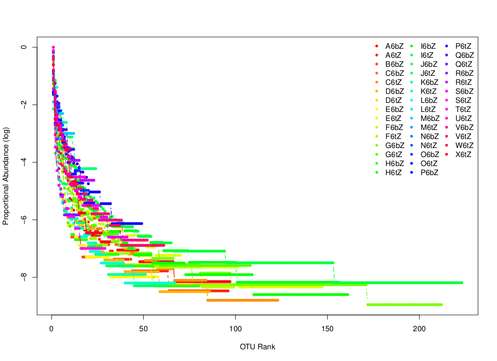
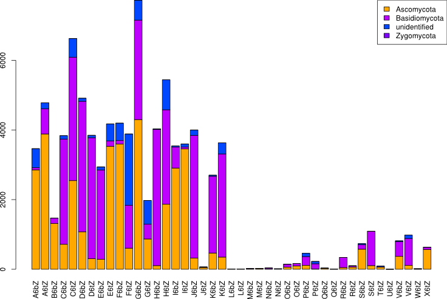
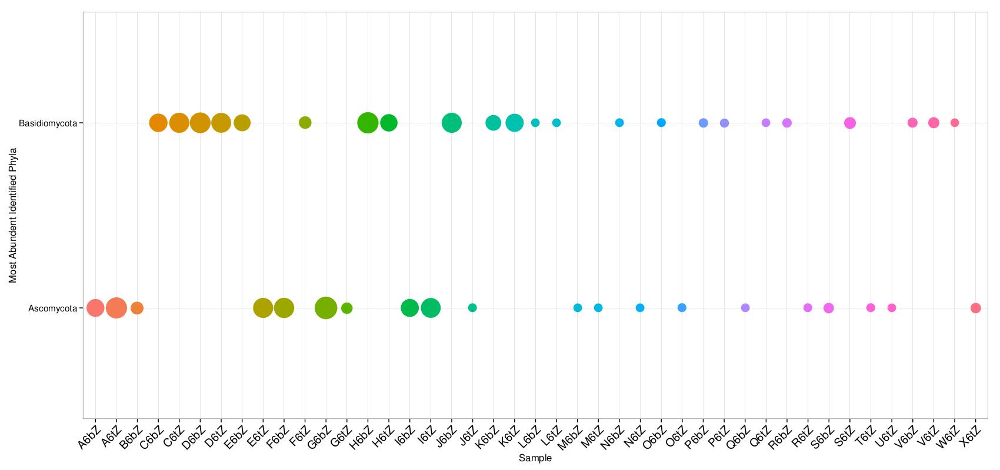
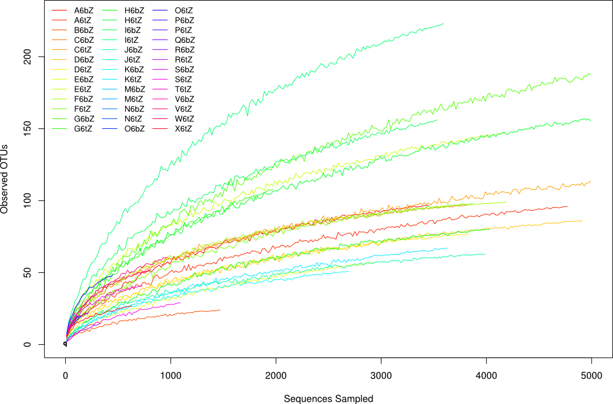
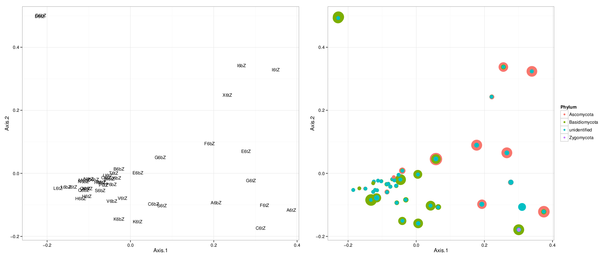

ITS_Amplicon_Pipeline
=====================
Pipeline for Zanne lab ITS amplicon analysis.

1. Install PandaSeq
        
        #Download and uncompress pandaseq
        wget https://github.com/neufeld/pandaseq/archive/master.zip
        unzip master.zip
        #Install necessary packages for running pandaseq
        sudo apt-get install build-essentials libtool automake zlib1g-dev
        #Cange into the pandaseq directory and install pandaseq
        cd pandaseq-master         
        ./autogen.sh && ./configure && make && sudo make install
        #If you receive an error that libpandaseq.so.[number] is not found on Linux run:
        sudo ldconfig     

2. Install Qiime. More notes on installing Qiime can be found [here] (http://qiime.org/install/install.html#rdp-install).

        #Install Qiime
        sudo apt-get install Qiime
        #Install UCLUST
        wget http://www.drive5.com/uclust/uclustq1.2.22_i86linux64
        sudo ln -s /path/to/uclustq1.2.22_i86linux64 /usr/local/bin/uclust
        #Install RDP
        wget -O rdp_classifier_2.2.zip "http://sourceforge.net/projects/rdp-classifier/files/rdp-classifier/rdp_classifier_2.2.zip/download"
        unzip rdp_classifier_2.2.zip
        echo "export RDP_JAR_PATH=/path/to/rdp_classifier-2.2.jar" >> $HOME/.bashrc
        source $HOME/.bashrc
        #Download and uncompress the biom-format library.
        wget ftp://thebeast.colorado.edu/pub/biom-format-releases/biom-format-1.1.2.tar.gz
        tar -xvzf biom-format-1.1.2.tar.gz
        #Create a file pointing python to the location of the biom library
        mkdir -p ~/.local/lib/python2.7/site-packages/
        echo "/path/to/biom-format-1.1.2/python-code/" > ~/.local/lib/python2.7/site-packages/biom.pth
            
3. Count on number of paired end reads in your fastq file and store in the variable READ_NUMBER.
        
        READ_NUMBER=`grep -c "@HWI-M013" yourFile_R1.fastq`
        echo $READ_NUMBER

4. Align paired end reads in [PandaSeq] (https://github.com/neufeld/pandaseq).

        pandaseq -f R1_file.fastq -r R2_file.fast2 -u unpaired.fasta > paired.fasta
        #Summarize pandaseq alignment
        ALIGNED=`grep -c ">HWI" paired.fasta` 
        UNALIGNED=`grep -c ">HWI" unpaired.fasta` 
        let " LOW_QUALITY = $READ_NUMBER - $ALIGNED - $UNALIGNED "
        echo -e "Total number of reads: $READ_NUMBER\nAligned: $ALIGNED\nNot Aligned: $UNALIGNED\nLow Quality: $LOW_QUALITY"
        
5. PandaSeq inserts a “-” between high-quality paired end reads that do not overlap. These sequences are placed in the unpaired.fastq file. For down stream analyses the “-” needs to be replaced with an “N”.
        
        #replace '-' only on lines that do not contain '>HWI-'
        sed '/>HWI\-/!s/\-/N/' unpaired.fasta > unpaired_N.fasta

6. Combine aligned and unaligned paired end reads into one file.

        cat unpaired_N.fasta paired.fasta > both.fasta 

7. Extraxt ITS reads using HMMs through [ITSx] (http://microbiology.se/software/itsx/)
  
        ITSx -i both.fasta -o ITSx_out -t F -cpu 15 -p /etc/system_scripts/ITSx_1.0b/ITSx_db/HMMs/
        #View summary of ITSx run
        cat ITSx_out.summary.txt
        
8. Format ITS fasta file for use with Qiime pipeline. The targets file maps sequences to barcodes and is provided by the sequenceing center.
        
        python format_for_qiime.py ITSx_out.full.fasta targets.txt

9. Download and uncompress UNITE reference OTUs. 
        
        wget https://github.com/downloads/qiime/its-reference-otus/its_12_11_otus.tar.gz   
        tar -xzf its_12_11_otus.tar.gz   
        gunzip ./its_12_11_otus/rep_set/97_otus.fasta.gz   
        gunzip ./its_12_11_otus/taxonomy/97_otu_taxonomy.txt.gz

10. Create a parameters file called params.txt.
    
        echo -e "assign_taxonomy:rdp_max_memory 8000\npick_otus:enable_rev_strand_match True\npick_otus:max_accepts 1\npick_otus:max_rejects 8\npick_otus:stepwords 8\npick_otus:word_length 8\nassign_taxonomy:id_to_taxonomy_fp its_12_11_otus/taxonomy/97_otu_taxonomy.txt\nassign_taxonomy:reference_seqs_fp its_12_11_otus/rep_set/97_otus.fasta\nbeta_diversity:metrics bray_curtis" > params.txt

11. Create a mapping file with metadata for each sample called map.txt. This file can be created maually according the the [specifications] (http://qiime.org/documentation/file_formats.html) on the Qiime website or automatically using generate_map_file.py.

        #-p is a list of plot ids, -d is a description of the experiment
        python generate_map_file.py -p 3H 4H -d First sequencing run for plots 3H and 4H from Idaho        

12. Generate 97% simmilarity OTUs using uclust and 97% simmilarity reference OTUs from UNITE. This is done using the pick_open_reference_otus pipeline in Qiime.

        pick_open_reference_otus.py -i inputFile.fasta -r /path/to/its_12_11_otus/rep_set/97_otus.fasta -o output_dir -p /path/to/params.txt --suppress_align_and_tree

13. Extract and plot number of sequences and OTUs per sample.
        
        #the input file for this script is often called final_otu_map_mc2.txt 
        python otu_count.py /path/to/final_OTU_file.txt
        #Generate summery OTU and read plots
        R CMD BATCH plot_reads_OTUs.R 

14. Extract OTU abundance and generate rank-abundance plots. The slope of a line on a rank-abundance plot is associated with species evenness. If most of the species have a similar number of individuals (high evenness), the line on the graph will have a smaller slope. A horizontal line indicates that all of the species have the same number of individuals. A community that is dominated by one or a few species will have a steep slope.

        python otu_abundance.py /path/to/final_OTU_file.txt 
        R CMD BATCH plot_rank_abundance.R 
        

Rank -abundance plot generated using plot_rank_abundance.R.

15\. Extract and plot taxonomic composition.

        #Summarize taxonomy
        python otu_to_taxonomy.py /path/to/final_OTU_file.txt /path/to/its_12_11_otus/taxonomy/97_otu_taxonomy.txt /path/to/rdp_assigned_taxonomy/rep_set_tax_assignments.txt  
        #Generate stacked barplots and most abundent taxa plots 
        R CMD BATCH SummarizeTaxonomy.R

Stacked barplot generated using SummarizeTaxonomy.R. Colors represent different phyla. This script will also generate stacked barplots at the class, order, family and genus levels.

Plot of must abundent identified phyla for each sample, generated using SummarizeTaxonomy.R. This script will also generate plots for the most abundant classes, orders, families, genera and species.   

16\. Perform rarefaction analysis and plot rarefaction curves. The rarefaction analysis is done using three Qiime scripts. 
        
        #Qimme rarefaction analysis
        multiple_rarefactions.py -i /path/to/final_OTU_file.biom  -m 10 -x 5000 -s 20 -n 10 -o rare_10_5000
        #-m Minimum number of seqs/sample for rarefaction, -x Maximum number of seqs/sample (inclusive) for rarefaction, -s Size of each steps between the min/max of seqs/sample (e.g. min, min+step... for level <= max).
        alpha_diversity.py -i rare_10_5000 -o alpha_rare -m observed_species, chao1
        collate_alpha.py -i alpha_rare -o alpha_collated
        #plot rarefaction curves 
        R CMD BATCH plot_rarefaction.R

Rarefaction curve generated using plot_rarefaction.R.

17\. Compute bray curtis dissimilarity metric for all pairwise comparisons of samples. Done using beta_diversity.py script in Qiime. Plot PCoA.
        
        #Generate bray curtis matirx in Qiime 
        beta_diversity.py -i /path/to/final_OTU_table.biom -o beta_diversity -m bray_curtis
        #plot PCoA
        R CMD BATCH plot_pcoa.R

PCoA plot generated using plot_pcoa.R. Samples are plotted on the left and phyla identified for each sample are plotted on the right, by abundance. This script also generates PCoA plots for classes and orders.  
